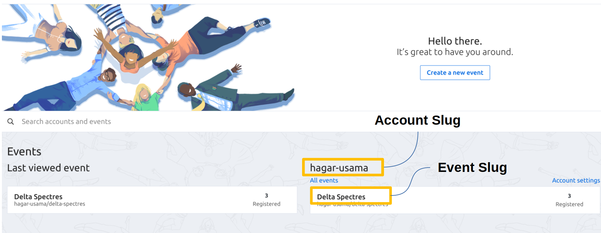
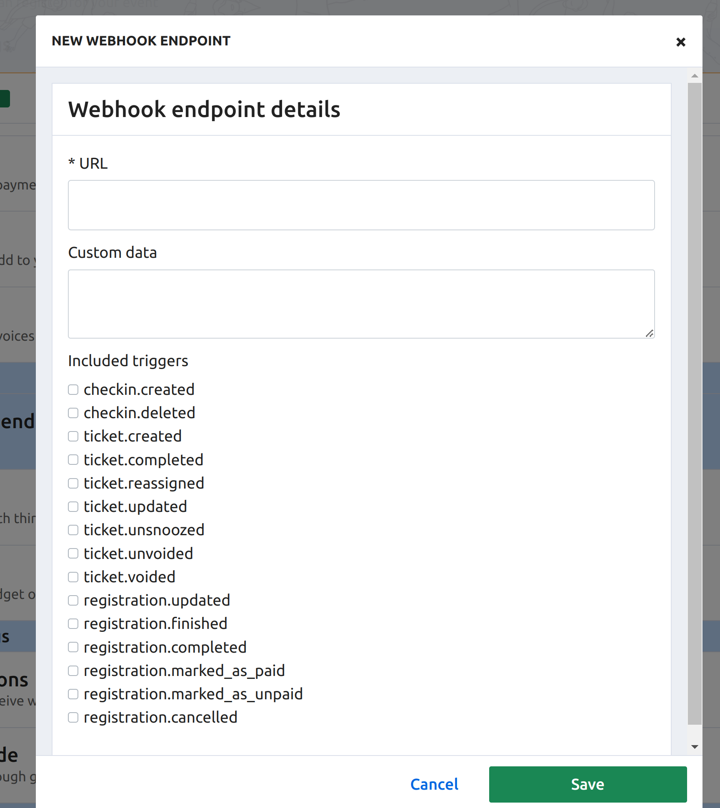
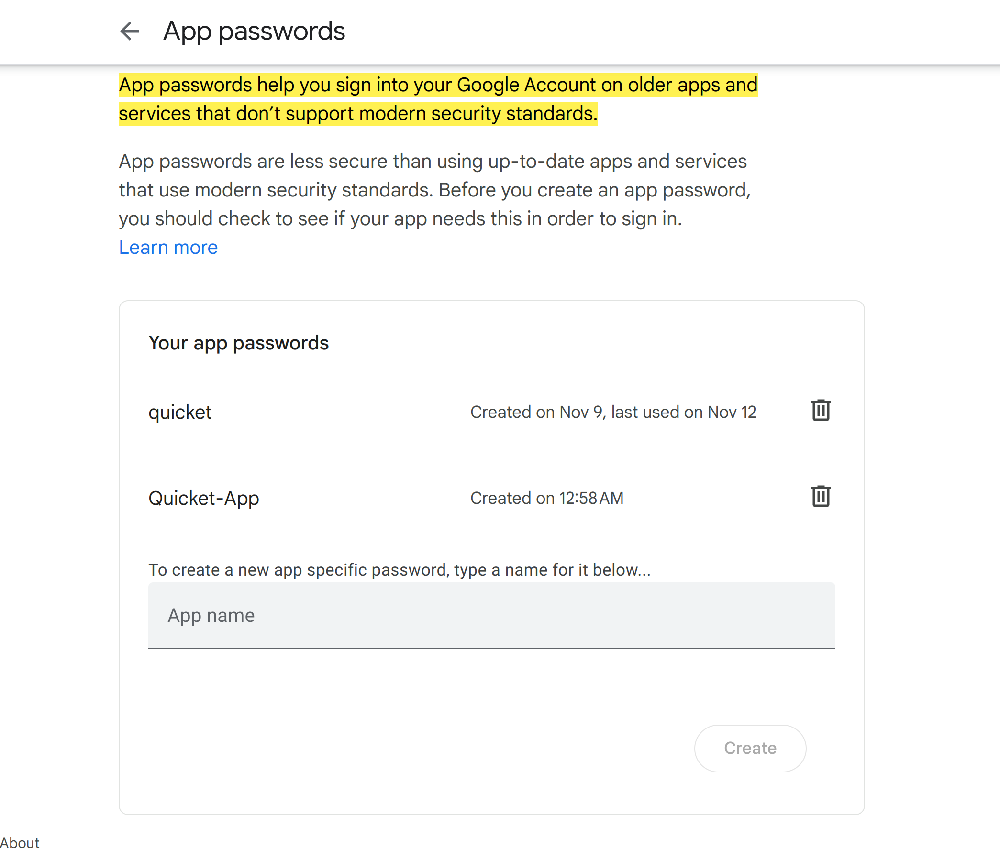
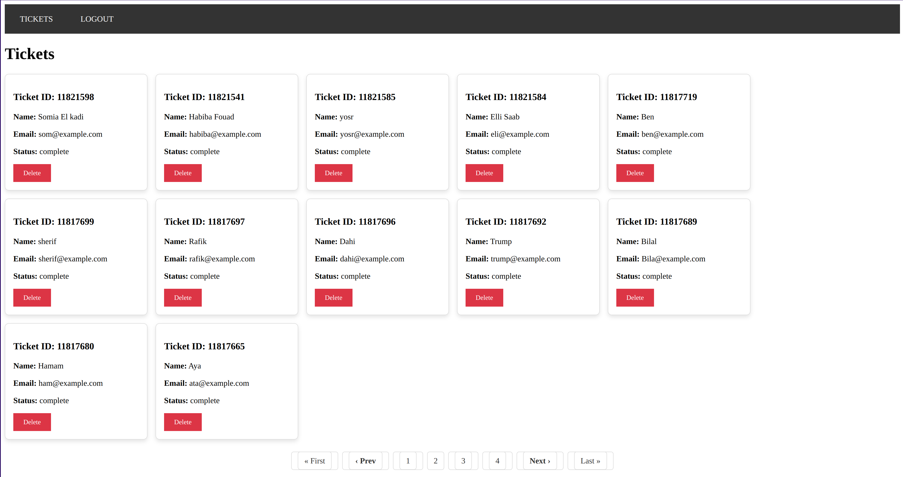
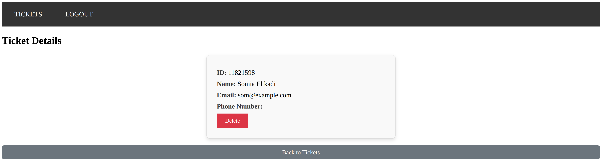
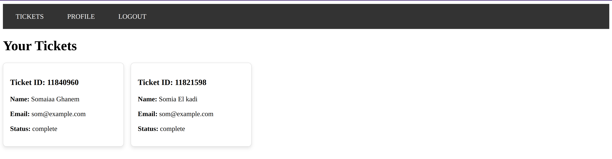
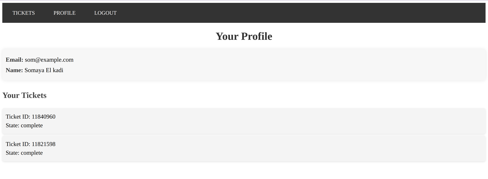

# Quicket Documentation

## Overview
**Quicket** is an event admission system built with Ruby on Rails. It integrates with the Tito API to manage and fetch tickets, providing both admin and regular users with specific access to event data. Users can register, log in, and manage their tickets, while administrators have full control over ticket data.

## Application Structure
Quicket is configured in a Docker environment, containing:
- **Postgres Service:** Stores user and ticket data.
- **Rails Service:** The core application handling API calls, user interactions, and background jobs.

The app follows standard Rails architecture, with components such as:
- **Controllers**: Handle requests and manage data flow.
- **Services**: Encapsulate business logic, like API interactions.
- **Models**: Define data structures and relationships (e.g., `User` and `Ticket` models).

## Key Components

### 1. **Entities**
   - **Users**: Each user can register, log in, and have multiple tickets.
   - **Tickets**: Retrieved from Tito’s API, tickets are associated with users and are updated in specific scenarios.

### 2. **Ticket Management & Synchronization**
   Tickets are automatically updated in three scenarios:
   - **Webhook Trigger**: When Tito issues a ticket creation or update event.
   - **User Registration**: Tickets sync upon new user registrations.
   - **Scheduled Job**: A background scheduler runs every hour to check for updates.

### 3. **User Authentication**
   The app uses **Devise** for user management, with email verification required before registration.

### 4. **Role-Based Views**
   - **Admin**: Can view and delete all tickets.
   - **Regular User**: Has access to their own tickets and profile only.

### 5. **Pagination**
   Ticket lists are paginated using **Kaminari** to improve load times and user experience.

### 6. **WebSocket (In Progress)**
   A WebSocket is being implemented to allow views to dynamically update when webhook triggers occur.

## API Integrations

Quicket integrates with the **Tito API** for ticket data:
- **Base URL**: `https://api.tito.io/v3`
- **Required Parameters**: `TITO_ACCOUNT_SLUG` and `TITO_EVENT_SLUG`.
- **Credentials**: Store the API token and webhook secret in `.env`.



## Environment Configuration


The application uses the `.env` for storing environment-specific configurations to keep sensitive information secure. The file is located in the Quicket root directory. (if not created, add it manually)

### .env File

The `.env` file holds non-sensitive variables required for the app's setup. Here's an example configuration:

```yaml
TITO_API_BASE="https://api.tito.io/v3"
TITO_ACCOUNT_SLUG=<your-account-slug>
TITO_EVENT_SLUG=<your-event-slug>

TUNNEL_HOST=<forwarding-address-to-localhost:3000>
TUNNEL_HOST_IP=<IP-for-the-forwarding-address>

MAILER_EMAIL=<the-email-for-sending-confirmation-emails>

TITO_TOKEN=<tito_secret_token> # Get this from https://id.tito.io/api-access-tokens
TITO_WEBHOOK_SECRET=<webhook_secret> # Available at https://dashboard.tito.io/<account-slug>/<event-slug>/settings/webhook_endpoints/

GMAIL_APP_KEY=<app_password_key> # Generate this at https://myaccount.google.com/apppasswords


```

#### **Explanation of Fields:**

- **TITO_API_BASE**: The base URL for the Tito API.
- **TITO_ACCOUNT_SLUG** & **TITO_EVENT_SLUG**: Replace `<your-account-slug>` and `<your-event-slug>` with your Tito account and event identifiers.
- **TUNNEL_HOST**: This is the public URL that maps to your local environment, allowing the app to receive webhooks. Use tunneling services like `ngrok` or `serveo.net` for this.
  - **For Serveo.net**, run the command below to expose your local server:
    ```bash
    ssh -R 80:localhost:3000 serveo.net
    ```
  - Once connected, copy the forwarding URL from the terminal (e.g., `https://9c990c9de1dc89d47247ef9c806a3348.serveo.net`) and set it as `TUNNEL_HOST`.
  - For **TUNNEL_HOST_IP**, retrieve the IP address of your forwarding URL using:
    ```bash
    nslookup <forwarding-address>
    ```
- **MAILER_EMAIL**: The email address used to send registration confirmations.
- **TITO_TOKEN**: The API token for authenticating with Tito. Obtain it from [Tito API Tokens](https://id.tito.io/api-access-tokens).
  - **Note**: Enable test data mode on Tito and add only free tickets to activate your event.
- **TITO_WEBHOOK_SECRET**: This token verifies incoming Tito webhook requests. To find it:
  - Go to `https://dashboard.tito.io/<account-slug>/<event-slug>/settings/webhook_endpoints/` and add a new endpoint.
  - Set the URL to `<tunneling-url>/webhooks/tito` and select the triggers `ticket.created` and `ticket.updated`.
- **GMAIL_APP_KEY**: An app-specific password for sending confirmation emails through Gmail. Generate this under [Google App Passwords](https://myaccount.google.com/apppasswords) for your **MAILER_EMAIL**.


**Tito webhook creation:**



**Gmail app password creation:**




### Instructions for Docker
To start the app in Docker, navigate to the application directory:
```bash
docker compose up
```

Access the app via `localhost:3000` or the forwarding address.

---

### Accessing the Rails Terminal in a Docker Container

To access the Rails terminal or perform further operations inside the Docker container, follow these steps:

1. **List Active Containers**  
   Use the following command to display all running Docker containers and locate the container ID for `quicket-web`:

   ```bash
   docker ps
   ```

2. **Enter the Container**  
   Once you have the container ID for `quicket-web`, use the command below to start a bash session inside it:

   ```bash
   docker exec -it <container ID> bash
   ```

3. **Set Up an Alias for Rails**  
   For smoother access to Rails commands, define an alias in the container’s bash profile. Run the following command:

   ```bash
   echo "alias rails='./bin/rails'" >> ~/.bashrc && source ~/.bashrc
   ```

   This will allow you to run `rails` directly within the container without needing the full path.

---


## Screenshots


### Admin Ticket View

### Admin Ticket Details

### User Ticket View

### User Profile View

